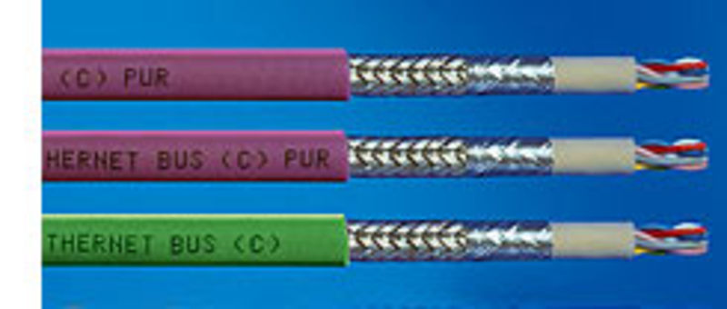
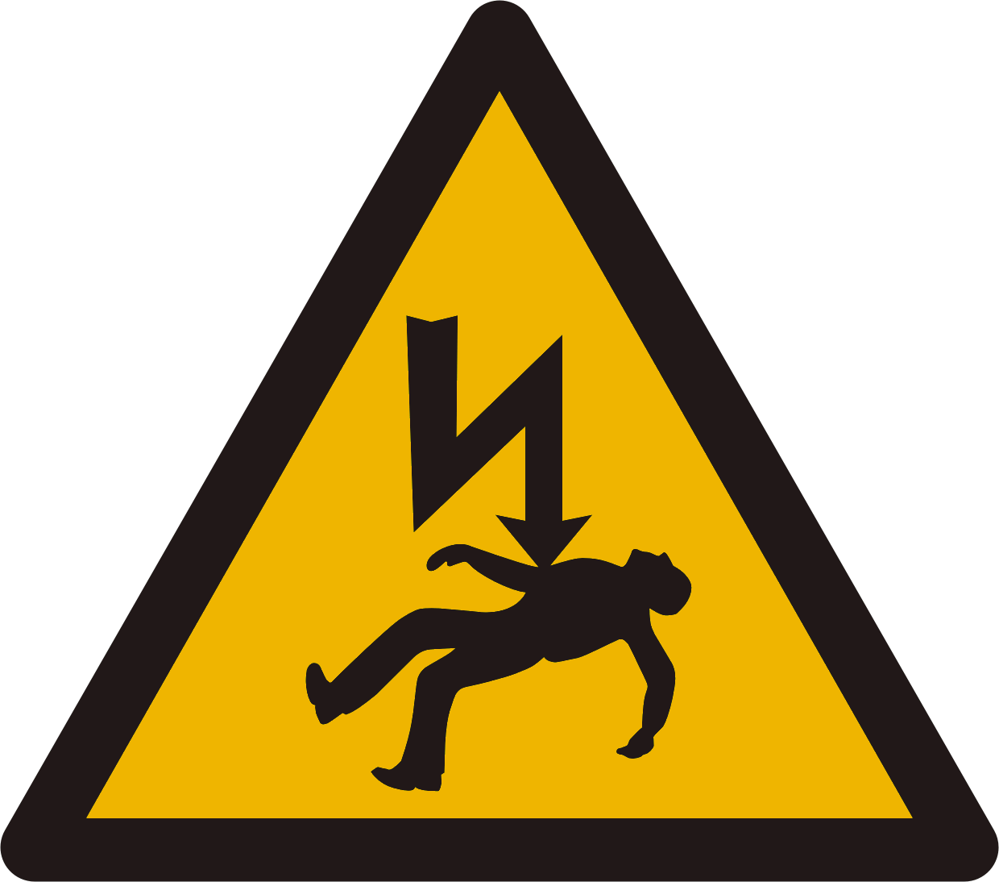
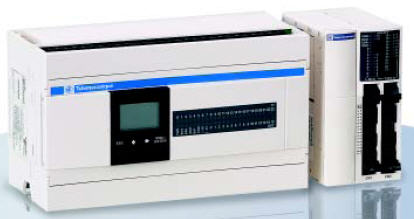
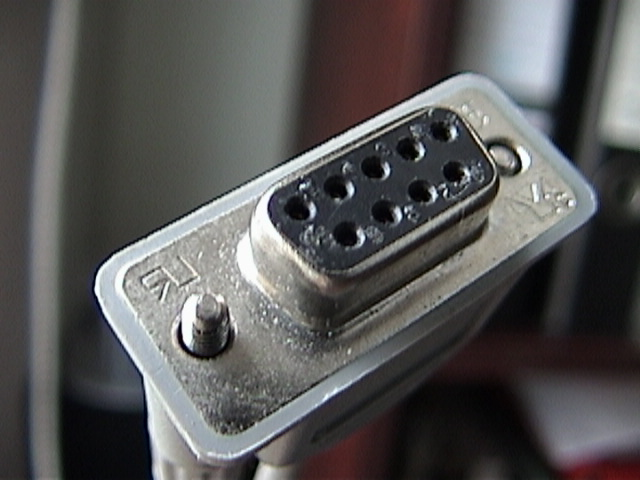
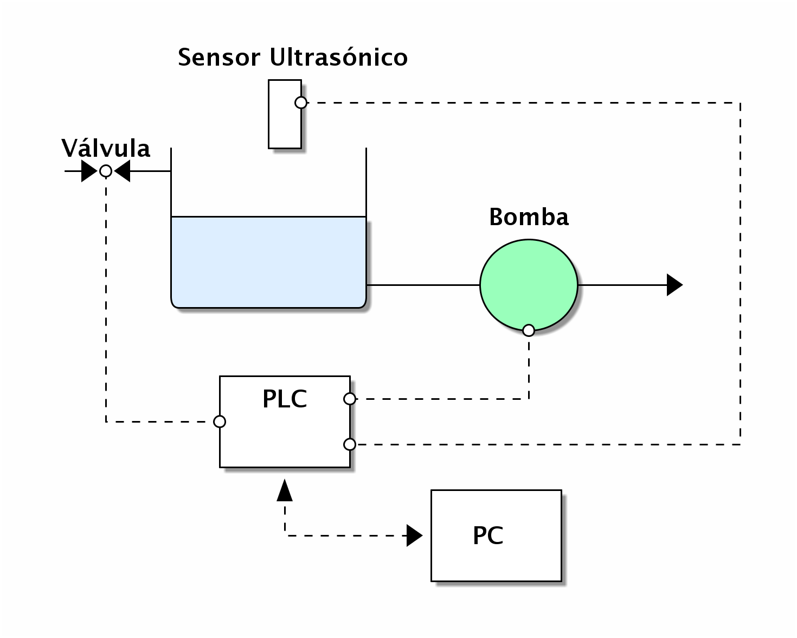
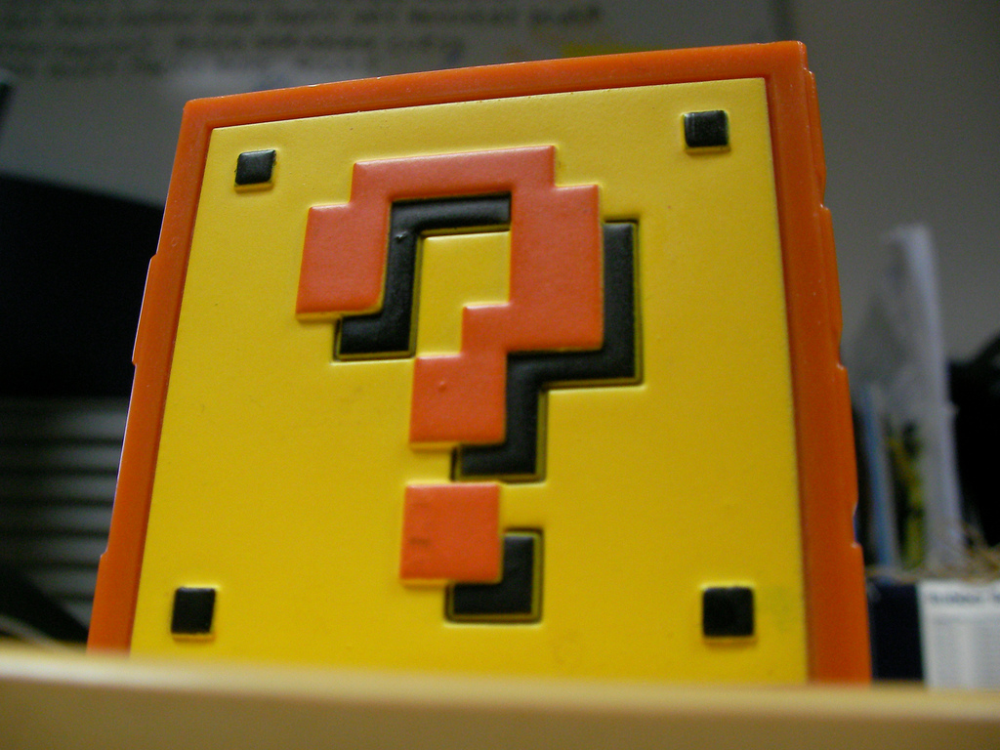

.. -*- mode: rst -*-

.. |cc| image:: src/cc.large.png
    :width: 60px

.. |by| image:: src/by.large.png
    :width: 60px

.. |sa| image:: src/sa.large.png
    :width: 60px

.. |nc| image:: src/nc.large.png
    :width: 60px

=============================================
Monitoreo y Control Industrial Usando Python
=============================================

:Autor: Joaquín Sorianello <soriasoft@gmail.com>
:Fecha: 16/10/2010
:Licencia: |cc| |by| |sa| CC-by-sa-2.5

De que se trata todo esto
==========================
Monitoreo
---------
* Adquirir Datos
* Procesarlos
* Almacenarlos
* Presentarlos

Control
-------
* Enviar consignas de control 
* Establecer parámetros en los dispositivos

Lo mas importante
=================

* La seguridad física de las personas.
* La seguridad de las instalaciones.
* La continuidad de los Procesos.

El concepto de SCADA
====================

SCADA es el acrónimo para Supervisory Control And Data Acquisition.
(Adquisición de Datos, Supervisión y Control)

Adquisición de Datos
--------------------
Obtener datos del campo.

Supervisión
-----------
Monitoreo de parámetros que permiten tomar decisiones (humanas o automáticas), sobre el proceso

Control
-------
Incio/parada de procesos, configuración de parámetros

Algunos Módulos Útiles
=======================================

* PySerial
* ModbusTk
* OpenOpc

PySerial
=====================================================
:url: http://pyserial.sourceforge.net/

Nos permite adquirir datos y controlar dispositivos utilizando un bus Serie RS-232 o RS-485 (entre otros)

Dispositivos
------------
* Phimetros
* Balanzas
* Conductivimetros
* Sensores ultrasónicos
* Caudalimetros

.. raw:: pdf
   
   PageBreak

Ventajas
---------
* Muchos dispositivos sencillos cuentan con terminales serie.
* No importa el tipo de Bus.
* Es sencillo realizar mockups de dispositivos serie, para la etapa de desarrollo y testing.

Desventajas
-----------
* Algunos protocolos y formatos de comunicación no están bien documentados.
* El acceso a parámetros suele ser limitado
* Generalmente no es posible tener mas de un dispositivo en el mismo bus.
* Tenemos que implementar nuestro propio control de errores para los datos que llegan

.. raw:: pdf

   PageBreak

Lectura de Peso de una balanza NC3M
-----------------------------------
Esta balanza de la empresa argentina industrias tecnológicas establece un formato propio para leer su salida de datos por puerto serie.

Formato del Dato
****************
.. code-block:: text
    
    <STX><SIGNO><NETO><STATUS><TARA><CR/LF>
    
    <STX> = 0x32 (decimal)(un byte)
    <SIGNO> = 0x20 (' ') (peso Positivo) o 0x2D (Peso negativo)
    <NETO> = 6 caracteres mas el punto decimal, (7 Bytes)
    <STATUS> =  
        'O'(0x4f) = Sobrecarga
        'M'(0x4d) = Movimiento
        ' '(0x20) = Pesada Valida
    <TARA> = mismo formato que neto
    <CR/LF> Retorno de Carro y salto de Linea 0x0D 0x0A

En python
*********
.. code-block:: python
    
    #!-*- coding: utf8 -*-
    """Cliente serie para la balanza nc3m"""
    
    import struct
    import serial
    import decimal
    
    def decimal_from_nc3m(nc3m_num):
        """Toma un numero en el formato NC3M y lo convierte a decimal"""
        nc3m_num = nc3m_num.replace(',', '.')
        return decimal.Decimal(nc3m_num)
    
    def main():
        #definimos el string de formato
        fcn = 'c8sc7s2c'
        #creamos una conexión serie
        ser = serial.Serial('vserial2')
        totalizador = 0
        #Adquirimos los datos
        while True:
            a = ser.readline() #Leemos una linea del buffer
            if len(a) == 19:
                stx, neto, status, tara, cr, lf = struct.unpack(fcn, a)
                if status == ' ':  #Chequeamos que la balanza esté en equilibrio
                    neto = decimal_from_nc3m(neto)
                    totalizador += neto
                    print "Peso Neto: %s Peso Acumulado: %s" % ( neto, totalizador)
    
    if __name__ == "__main__":
        print "Cliente serie para balanza NC3M"
        main()

ModbusTk |modbus|
==================

ModbusTk, es un toolkit para comunicarse con dispositivos de campo, utilizando el protocolo Modbus, ya sea RTU o TCP/IP y para crear dispositivos virtuales (Muy útil para realizar mockups)

.. |modbus| image:: src/modbus.jpg
   :width: 100%

Como funciona Modbus (en forma muy general)
----------------------------------------------

Modbus tiene una arquitectura Maestro-Esclavo, donde un único dispositivo Maestro recoge datos y establece parámetros en los dispositivos Esclavos.
Establece en los dispositivos cuatro tipos de registros:

* Discretas
    - Solo lectura
    - lecto-escritura
* Analógicas
    - solo lectura
    - lecto-escritura.

Ademas establece códigos de funciones, para realizar operaciones en dichos registros

Ventajas
--------
* El protocolo Modbus es abierto y esta completamente documentado.
* En Modbus/RTU podemos tener muchos dispositivos en el mismo bus.
* Existen conversores de ModbusRTU en ModbusTCP/IP
* Tiene control de errores.
* No depende de la plataforma
* ¿Ya dije que es un protocolo abierto?

Desventajas
-----------
* Muchos PLC (Siemens, por ejemplo) y dispositivos de gama baja no lo implementan.
* ModbusRTU no soporta Mulimaster.

Ejemplo
-------
Tanque con sensor ultrasónico, una válvula y una bomba, gobernado por un PLC

 
.. code-block:: python
   :include: code/ModbusMaster.py

OpenOPC |opc|
===============

.. |opc| image:: src/opc_logo.gif
   :width: 50%
   
Es un toolkit OPC-DA para python.

Que es OPC?
-----------
Es el acrónimo para Object Linking and Embedding (OLE) for Process Control.
Es un estándar que permite la comunicación en tiempo real entre aplicaciones de distintos fabricantes.
Los datos se obtienen a través de *Servidores OPC*
Hay varias versiones, pero la mas utilizada es OPC-DA (fuertemente atada a Window$, ya que utiliza DCOM)

Ventajas
--------
* No tenemos que preocuparnos en la comunicación explicita con los dispositivos.
* Es sencillo de utilizar.
* Podemos acceder a muchos dispositivos con diversos protocolos, con una interfaz común.
* Es la única forma (estable) que encontré para comunicarme con dispositivos Siemens de gama media/baja.
* OpenOPC puede ser utilizado para acceder de forma remota a servidores OPC utilizando PyRO

Desventajas
-----------
* Los Servidores suelen ser pagos (y bastante caros)
* Necesitamos un equipo con windows

Ejemplo
-------
TODO

Otros módulos de comunicaciones
===============================

Porque Python
=============
Su gran cantidad de modulos:

* Toolkits Graficos
    - PyQt
    - PyGTK
    - WxPython
* Herramientas para Graficación:
    - MatplotLib
* ORMs
    - Sql Alchemy
    - Elixir
* Frameworks Web
    - Django
    - Bottle

* Twisted

Que permiten crear soluciones sofisticadas e innovadoras en materia de supervisión y control industrial

¿Preguntas?
===========

|cc| |by| |nc| http://www.flickr.com/photos/stu_p/

 
